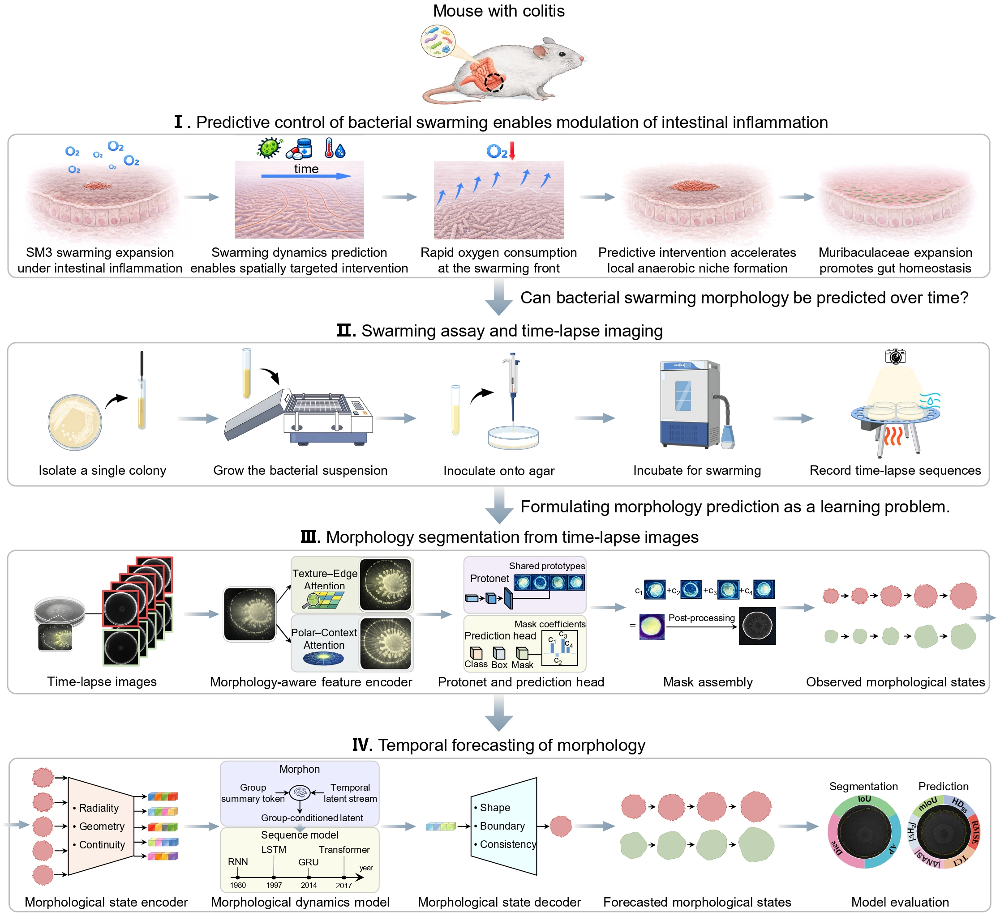

# From Shape to Fate: making bacterial swarming expansion predicate
## Morpher: Morphology-Aware Segmentation and Forecasting of Bacterial Swarming

This repository provides the **complete, paper-aligned implementation** of a morphology-aware framework for making bacterial swarming expansion **predictable**.  
The framework consists of two tightly coupled components:

- **Morpher-S** — a texture- and geometry-aware **segmentation network** that produces stable, boundary-resolved swarm masks.
- **Morpher-F** — an **autoregressive temporal forecasting model** that operates directly in **mask space** to predict the future evolution of swarming colony morphology.

Morpher-S provides a high-quality morphological substrate, while **Morpher-F serves as the core model** for long-horizon, geometry-consistent forecasting.

---

## Overview
<p align="center">
  
</p>
Bacterial swarming colonies exhibit complex, anisotropic expansion characterized by diffuse and fingered fronts.  
Conventional video prediction models often fail to preserve boundary localization and structural coherence over extended time horizons.

This framework reformulates swarming expansion as a **morphological forecasting problem in a geometric state space**:

- **Morpher-S** stabilizes segmentation by preserving fine-scale front geometry.
- **Morpher-F** models the **temporal dynamics of shape**, rather than raw image intensity.

Both components are evaluated on the **SwarmEvo** dataset.

---

# Part I — Morpher-S (Segmentation)

## Training Configuration

| Item | Description |
|---|---|
| Framework backend | PyTorch with Ultralytics YOLO interface. Training is built on the Ultralytics training engine. |
| Determinism | `torch.use_deterministic_algorithms(False)` to allow non-deterministic operations for improved efficiency. |
| cuDNN settings | `cudnn.deterministic=False`, `cudnn.benchmark=True`, prioritizing throughput over strict determinism. |
| Model definition | `ultralytics/cfg/models/Morpher-S/Morpher-S.yaml`. Users may adjust depth, width, or module composition. |
| Dataset config | `data.yaml`, defining dataset paths, class names, and splits. |
| Image size | `imgsz = 640`. |
| Training epochs | `epochs = 800`. |
| Batch size | `batch = 16`. |
| Single-class mode | `single_cls = True`. |
| DataLoader workers | `workers = 0`. |
| Random seed | `seed = 0`. |
| Mixed precision | `amp = False`. |
| Device | `device = 'cpu'` by default; configurable to CUDA. |
| Training entry | `YOLO(...).train(...)`. |

> **Note.** Non-deterministic cuDNN behavior is enabled by default to maximize training throughput. All settings are configurable.

---

## Dataset (Morpher-S)

Morpher-S is trained using the **Segmentation** subset of **[SwarmEvo](https://huggingface.co/datasets/SwarmEvo)**.

The dataset provides boundary-resolved polygon annotations in **YOLO-seg format** (`.txt`), paired with raw microscopy images.  
All dataset paths, splits, and class definitions are specified via `data.yaml`.

---

# Part II — Morpher-F (Temporal Forecasting)

## Model Overview

**Morpher-F** is an **autoregressive mask-space forecasting model** designed to predict the temporal evolution of swarming colony morphology.

Instead of predicting raw pixels or videos, Morpher-F forecasts **binary segmentation masks**, aligning directly with the biological interpretation of swarming growth as front advancement and curvature evolution.

---

## What Morpher-F Provides

- Loading sequence-organized YOLO-seg polygon annotations
- Rasterization into binary masks
- Temporal downsampling via a fixed stride `step`
- **Strict autoregressive forecasting** with:
  - GRU
  - LSTM
  - RNN
  - Transformer Encoder
- Quantitative evaluation using:
  - **mIoU**
  - **mAP@[.50:.95]**
  - **HD / HD95 / ASSD**
- Optional **physics-consistency statistics** via `--phys_stats`

---

## Method Summary

- **SpatialEncoder** encodes each mask frame into a latent representation `z_t` and retains multi-scale features for decoding.
- **Morphon** aggregates historical latent states using attention with gated fusion (`alpha`).
- **Temporal backbone**: `arch ∈ {gru, lstm, rnn, transformer}` with sinusoidal positional encoding.
- **Inference** is strictly autoregressive:  
  `predict → sigmoid → re-encode → append to history`.

---

## Requirements

- Python ≥ 3.9  
- PyTorch ≥ 2.0  
- CUDA optional  
- Windows / Linux supported

---

## Installation

```bash
pip install numpy scipy pillow torchvision opencv-python tqdm timm
```

---

## Dataset (Morpher-F)

Morpher-F uses the **Prediction** subset of **[SwarmEvo](https://huggingface.co/datasets/SwarmEvo)**.  
Only the `SwarmEvo/prediction/` directory is required.

### Directory Layout

```text
dataset/
├── train/
│   ├── 1/
│   │   ├── 1_0001.txt
│   │   └── ...
│   └── 2/
│       └── ...
└── test/
    └── 3/
        └── ...
```

- One folder per sequence
- One `.txt` per time step
- Filenames must be numerically sortable
- YOLO-seg polygons normalized to `[0, 1]`
- Multiple instances are unioned into a single mask
- `Images_for_prediction/` is optional and used only for visualization

---

## Training-Time Augmentation

Applied **only during training**:

- Random rotation
- Translation
- Horizontal flipping
- Vertical flipping

No augmentation is applied during validation or testing.

---

## Optimization Objective

Composite loss:

- **Focal Loss**
- **Soft IoU Loss**
- **Boundary-aware Loss** (downsampled for efficiency)

---

## Key Hyperparameters (Defaults)

| Parameter | Value |
|---|---|
| Image size | `640` |
| Temporal stride | `25` |
| Observation ratio | `0.8` |
| Batch size | `2` |
| Epochs | `300` |
| Learning rate | `5e-5` |
| Optimizer | AdamW (`weight_decay=1e-4`) |
| Scheduler | Warmup + cosine |
| AMP | Enabled on GPU |
| torch.compile | Optional |

---

## Training Command (Transformer Example)

### Windows

```bat
python Morpher-F.py train ^
  --arch transformer ^
  --train_path dataset\train ^
  --val_path dataset\test ^
  --img_size 640 ^
  --step 25 ^
  --obs_ratio 0.8 ^
  --batch_size 2 ^
  --epochs 300 ^
  --lr 5e-5 ^
  --results_dir results ^
  --save_name best_transformer.pth ^
  --log_csv results\train_log_transformer.csv ^
  --torch_compile ^
  --torch_compile_mode max-autotune
```

### Linux / macOS

```bash
python Morpher-F.py train \
  --arch transformer \
  --train_path dataset/train \
  --val_path dataset/test \
  --img_size 640 \
  --step 25 \
  --obs_ratio 0.8 \
  --batch_size 2 \
  --epochs 300 \
  --lr 5e-5 \
  --results_dir results \
  --save_name best_transformer.pth \
  --log_csv results/train_log_transformer.csv \
  --torch_compile \
  --torch_compile_mode max-autotune
```

---

## Entry Point

- Single-file design: `Morpher-F.py`
- Supported commands: `train`, `test`

---

## Citation

If you use **Morpher-S** or **Morpher-F**, please cite:

*Population-Scale Advancing Interface Modeling Reveals How Bacterial Swarms Encode Future Spatial Architecture*  
https://arxiv.org/abs/2602.01056

```bibtex
@article{duan2026population,
  title   = {Population-Scale Advancing Interface Modeling Reveals How Bacterial Swarms Encode Future Spatial Architecture},
  author  = {Duan, Shengyou and Wang, Zhaoyang and Xiong, Kaiyi and Zhu, Jin and Gu, Pengxi and Chen, Weijie and Xin, Hongyi and Qu, Zijie},
  journal = {arXiv preprint arXiv:2602.01056},
  year    = {2026},
  url     = {https://arxiv.org/abs/2602.01056}
}
```

---

## License

This code is released for **academic research use only**.
